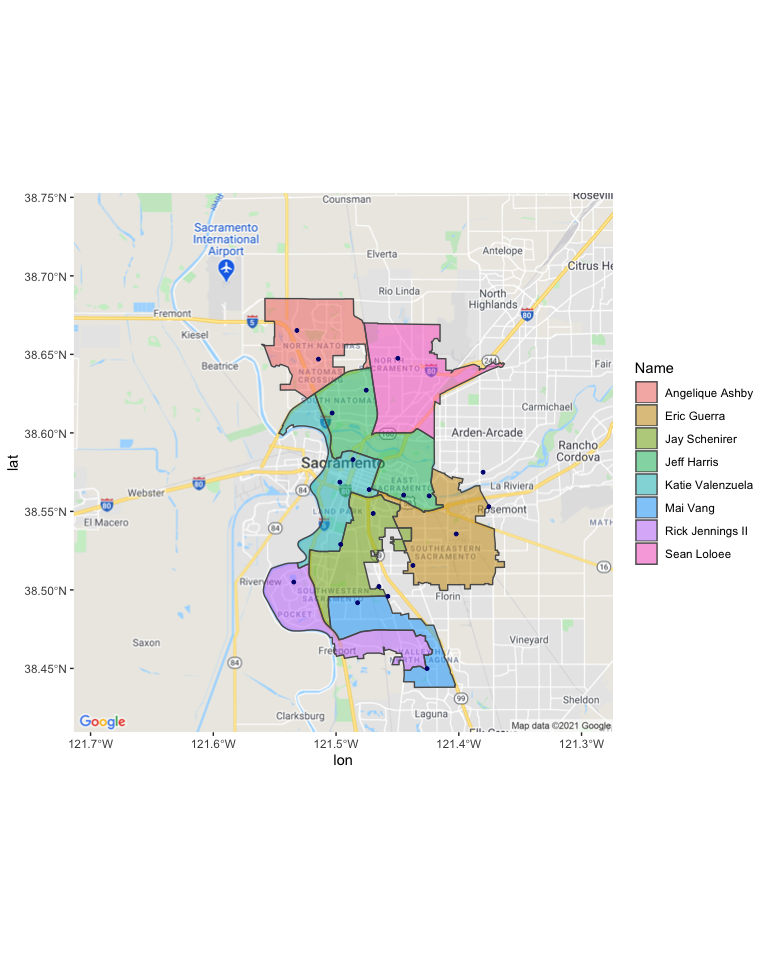

sac\_cc\_districts
================

**Locating City Council District based on Address**

This is a notebook I created to locate city council districts given an
address. It’s meant to work with downloaded data from Action Network.

This work was done for [Sac Kids First](https://sackidsfirst.org/).

### Read in Council District KML Data

This dataset is from [Sacramento Open
Data](https://data.cityofsacramento.org). It’s very well maintained! I’m
using the `sf` package to read it in.

``` r
cc <- st_read("Council_Districts.kml")
```

    ## Reading layer `Council_Districts' from data source `/Users/shokawano/coding/sac_cc_districts/Council_Districts.kml' using driver `KML'
    ## Simple feature collection with 8 features and 2 fields
    ## geometry type:  MULTIPOLYGON
    ## dimension:      XY
    ## bbox:           xmin: -121.5607 ymin: 38.43791 xmax: -121.3628 ymax: 38.68561
    ## CRS:            4326

``` r
cc[1]
```

    ## Simple feature collection with 8 features and 1 field
    ## geometry type:  MULTIPOLYGON
    ## dimension:      XY
    ## bbox:           xmin: -121.5607 ymin: 38.43791 xmax: -121.3628 ymax: 38.68561
    ## CRS:            4326
    ##               Name                       geometry
    ## 1 Rick Jennings II MULTIPOLYGON (((-121.5029 3...
    ## 2 Katie Valenzuela MULTIPOLYGON (((-121.5467 3...
    ## 3      Sean Loloee MULTIPOLYGON (((-121.42 38....
    ## 4      Jeff Harris MULTIPOLYGON (((-121.4213 3...
    ## 5      Eric Guerra MULTIPOLYGON (((-121.3815 3...
    ## 6    Jay Schenirer MULTIPOLYGON (((-121.4497 3...
    ## 7         Mai Vang MULTIPOLYGON (((-121.4115 3...
    ## 8  Angelique Ashby MULTIPOLYGON (((-121.5003 3...

### Load in Addresses, Convert to Coordinates (Geocoding)

Now we’re loading in a bunch of random addresses I picked from around
the Sacramento region. It’s in the same format from Action Network so it
should work with the activist data. On the second line, I use Regular
Expressions (Regex) to remove apartment/unit numbers which can create
problems.

``` r
addresses <- read.csv('test.csv')

# (?i) - case insenstive match
addresses$address <- gsub("(\\#|(?i)apt|(?i)unit).*", "", 
                               addresses$address, perl=TRUE)
#remove commas & periods
addresses$address <- gsub("(\\,|\\.)", "", 
                               addresses$address, perl=TRUE)

addresses <- addresses %>% 
  mutate(full_address = paste(address, city, state, zip_code, sep=", ")) 
```

We then use `geocode` from `tinygeocoder`. It’s a very handy function
and easy to use. Here is the result. Note that some places are outside
of the city limits.

``` r
addresses  <- tidygeocoder::geocode(addresses %>% select(name, full_address), full_address, method = "osm")
addresses 
```

    ## # A tibble: 22 x 4
    ##    name                  full_address                                  lat  long
    ##    <chr>                 <chr>                                       <dbl> <dbl>
    ##  1 ARCO Arena            1 Sports Pkwy, Sacramento, CA, 95834         38.6 -122.
    ##  2 Natomas Middle School 3200 N Park Dr, Sacramento, CA, 95835        38.7 -122.
    ##  3 Nash & Proper         3270 Northgate Blvd, Sacramento, CA, 95833   38.6 -121.
    ##  4 Saigon Corner         1589 W El Camino Ave, Sacramento, CA, 95833  38.6 -122.
    ##  5 Las Nenas Taqueria    716 Bell Ave, Sacramento, CA, 95838          38.6 -121.
    ##  6 South                 2005 11th St, Sacramento, CA, 95818          38.6 -121.
    ##  7 La Favorita Taqueria  8887 Folsom Blvd , Sacramento, CA, 95826     38.6 -121.
    ##  8 Sac State             6000 J St, Sacramento, CA, 95819             38.6 -121.
    ##  9 Trader Joe's          5000 Folsom Blvd, Sacramento, CA, 95819      38.6 -121.
    ## 10 McClatchy Park        3500 5th Ave, Sacramento, CA, 95817          38.5 -121.
    ## # … with 12 more rows

### Find CC District based on Address

Now we use st\_intersecs to find out which addresss is in which
district.

``` r
pnts = addresses %>% select(long, lat)

address_sf <- do.call("st_sfc",c(lapply(1:nrow(pnts), 
function(i) {st_point(as.numeric(pnts[i, ]))}), list("crs" = 4326))) 

address_trans <- st_transform(address_sf, 2163) # apply transformation to pnts sf
cc_trans <- st_transform(cc[1], 2163)      # apply transformation to polygons sf

# intersect and extract state name
addresses$council_member <- apply(st_intersects(cc_trans, address_trans, sparse = FALSE), 2, 
               function(col) { 
                  cc_trans[which(col), ]$Name
               }) %>% as.character()
```

We create a small dataframe to match each council member to a district
number.

``` r
districts = data.frame(council_member = c("Angelique Ashby", "Sean Loloee", 
                                          "Jeff Harris", "Katie Valenzuela", 
                                          "Jay Schenirer", "Eric Guerra",  
                                            "Rick Jennings II", "Mai Vang"), 
         cc_district = 1:8)
```

Now we left\_join the data frame above and we have our result! Note that
the following places are outside of the city limits so has no council
district:

-   99 Ranch (off of highway 99 - not in city limits)
-   Kingdom Coffee Roasters (Folsom)
-   Temple Coffee (Arden)

``` r
addresses %>% select(name, full_address, council_member) %>% 
            left_join(districts)
```

    ## # A tibble: 22 x 4
    ##    name             full_address                     council_member  cc_district
    ##    <chr>            <chr>                            <chr>                 <int>
    ##  1 ARCO Arena       1 Sports Pkwy, Sacramento, CA, … Angelique Ashby           1
    ##  2 Natomas Middle … 3200 N Park Dr, Sacramento, CA,… Angelique Ashby           1
    ##  3 Nash & Proper    3270 Northgate Blvd, Sacramento… Jeff Harris               3
    ##  4 Saigon Corner    1589 W El Camino Ave, Sacrament… Jeff Harris               3
    ##  5 Las Nenas Taque… 716 Bell Ave, Sacramento, CA, 9… Sean Loloee               2
    ##  6 South            2005 11th St, Sacramento, CA, 9… Katie Valenzue…           4
    ##  7 La Favorita Taq… 8887 Folsom Blvd , Sacramento, … Eric Guerra               6
    ##  8 Sac State        6000 J St, Sacramento, CA, 95819 Jeff Harris               3
    ##  9 Trader Joe's     5000 Folsom Blvd, Sacramento, C… Jeff Harris               3
    ## 10 McClatchy Park   3500 5th Ave, Sacramento, CA, 9… Jay Schenirer             5
    ## # … with 12 more rows

### Plotting the Results

Here I download the basemap for the Sacramento region.

``` r
map <- get_googlemap("Sacramento, California", zoom = 11, maptype = "roadmap")
```

    ## Source : https://maps.googleapis.com/maps/api/staticmap?center=Sacramento,%20California&zoom=11&size=640x640&scale=2&maptype=roadmap&key=xxx

    ## Source : https://maps.googleapis.com/maps/api/geocode/json?address=Sacramento,+California&key=xxx

Using ggmap, I map the layers along with the addresses! Woo hoo!

``` r
map %>% ggmap() + 
    geom_sf(data = cc[1], 
            aes(fill = Name),
             inherit.aes = FALSE, alpha=0.5)  +
    geom_point(data = addresses, aes(x = long, y = lat), color = "navy", size = 1)
```

<!-- -->
